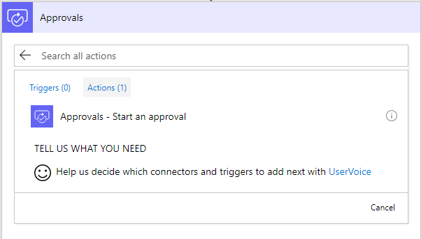

# ActionableMessages
The goal of this project is to create an Open API Definition (Swagger definition) to create Actionable Messages in Microsoft Flow and PowerApps.

This is to allow Actionalable Cards to be called from PowerApps and Flow.

Actionable message cards are messages that users can interact with inside Outlook, Microsoft Teams, and Microsoft Flow app.

Here are the references to Actionable Message Cards:
- [Card Reference](https://docs.microsoft.com/en-us/outlook/actionable-messages/card-reference)
- [Card Playground](https://messagecardplayground.azurewebsites.net/)

If you are new to Actionable Message Cards, it is worth experimenting with cards using the Card Playground first to get an idea for what cards are and can do.

While it is possible to send a card in Microsoft Flow, using the "Approval" action, you cannot send it any other way from Flow.

In order be able to send an Actionable Message from PowerApps or Flow, the following will need to be done:

1. Register with the Developer Dashboard;
2. Create Azure Logic App to send the Actionable Card;
2. Take the full specification of Actionable Cards, and create the Swagger api definition
3. Import into PowerApps as a new custom connection
